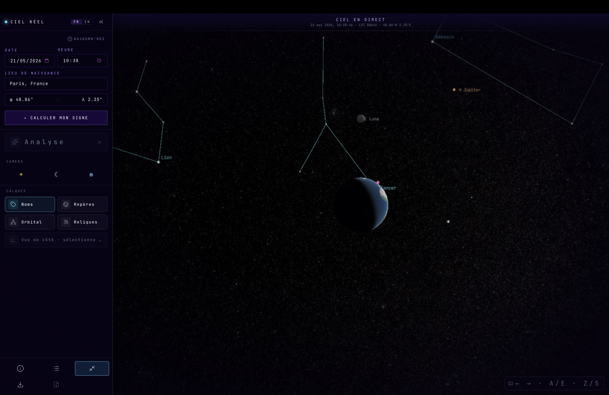

# Signe Astronomique

> A web cockpit that computes your **true astronomical sign** — the constellation the Sun was actually in when you were born, using IAU 1930 boundaries, equinox precession, and Ophiuchus as the 13th sign.

     



**Live demo:** <https://signe-astronomique.netlify.app/>

---

## What it does

The app renders a Cesium 3D scene centered on Earth, surrounded by a geocentric celestial sphere: the Sun, the Moon, the planets, the full Hipparcos star catalog with clickable constellations, a handful of historic relic satellites (ISS, Hubble, Sputnik, …) and — optionally — the entire active orbital population, propagated in real time via SGP4.

Every body is pickable. Selecting one opens a HUD panel and unlocks two complementary visualizations:

- **Side view** — camera perpendicular to the Earth → constellation axis, with a graduated distance ruler in light-years.
- **Depth view** — the constellation "exploded" so each star sits at its real distance, making the depth disparity legible at a glance.

A natal report is rendered alongside the 3D view: ascendant constellation, planetary positions, and the 360° ecliptic radar with IAU angular sizes. A "share this sky" button copies a self-contained URL that opens directly on the recipient's recomputed chart.

## Why it matters

Mainstream astrology uses the **tropical zodiac**, a fiction frozen ~2000 years ago. Because of equinox precession, your tropical "sign" no longer matches the constellation the Sun was in when you were born. This project does the actual sidereal computation — RA/Dec in J2000, then epoch correction — and projects the Sun's position onto the IAU 1930 constellation boundaries. Most people end up with a different sign than their horoscope, and many fall into Ophiuchus.

## Tech stack

- **[Vite 8](https://vite.dev)** + **[React 19](https://react.dev)** + **TypeScript 6**
- **[CesiumJS 1.140](https://cesium.com/platform/cesiumjs/)** (via `vite-plugin-cesium`) for the 3D scene
- **[satellite.js](https://github.com/shashwatak/satellite.js)** for SGP4 propagation (ECI → ECEF)
- **[Framer Motion](https://www.framer.com/motion/)** for the HUD
- **[lucide-react](https://lucide.dev)** for rail icons
- **[html2canvas-pro](https://github.com/yorickshan/html2canvas-pro)** for the PDF report capture
- **[Tailwind v4](https://tailwindcss.com)** (`@tailwindcss/vite`)
- **[tz-lookup](https://github.com/darkskyapp/tz-lookup)** for timezone resolution from coordinates

No Cesium Ion token is required: imagery is served from NASA GIBS (Blue Marble + VIIRS Black Marble), and `Ion.defaultAccessToken = ''` prevents the default Bing fetch.

## Run locally

```bash
npm install
npm run dev      # Vite dev server (http://localhost:5173)
npm run build    # type-check + production bundle
npm run preview  # serve the local production bundle
npm run lint
```

**Browser support:** modern Chrome / Firefox / Safari with WebGL2. The PNG export uses `preserveDrawingBuffer: true` on the Cesium viewer.

**Bundle size:** the production bundle is large (~860 kB / ~266 kB gzipped) — Cesium dominates. This is a deliberate trade-off: the app's value is the 3D scene, and Cesium is loaded eagerly so the cockpit hydrates fully on first paint.

## Architecture

Feature-driven layout: each feature owns its UI, hooks, helpers and data, and exposes a single `index.ts` barrel as its public API. The four cross-feature shared layers (`ui`, `context`, `i18n`, `types`) stay flat at the root. The path alias `@/` resolves to `src/`, so consumers reach a feature through `@/features/<name>` and never via deep relative imports.

```
src/
├── App.tsx                       minimal entry point — renders <Cockpit />
├── main.tsx                      bootstrap + dev-tools signature banner
├── features/
│   ├── astronomy/                framework-agnostic engine (no React, no DOM, no Cesium)
│   │   ├── astroEngine.ts                IAU 1930 boundaries, RA/Dec → constellation projection
│   │   ├── planetEngine.ts               planetary ephemerides
│   │   ├── skyCoordinates.ts             ICRS ↔ ECEF, celestial sphere, AU constants
│   │   ├── constellationLore.ts          FR/EN names, mythology, didactic copy
│   │   ├── formatDistance.ts             locale-aware km/AU formatter + EARTH_RADIUS_M
│   │   ├── data/constellations.json      Hipparcos catalog (stars + pattern lines)
│   │   ├── data/constellationCatalog.ts  typed JSON loader
│   │   └── index.ts                      barrel — public API
│   ├── natal-input/              coordinate capture + share-link encoding
│   │   ├── CoordinatesForm.tsx           date / time / location form
│   │   ├── CityAutocomplete.tsx          Nominatim autocomplete
│   │   ├── MobileCoordinatesModal.tsx    fullscreen mobile variant
│   │   ├── computeReadingFromForm.ts     wall-clock form → CelestialReading
│   │   ├── shareLink.ts                  URL-param encode/decode for shareable links
│   │   ├── useNatalForm.ts               default city + date/time state (URL-hydrated)
│   │   ├── useShareLink.ts               clipboard + auto-jump on share-link landing
│   │   ├── useSearchHistory.ts           localStorage-backed recent natal queries
│   │   ├── useGeolocation.ts             browser geolocation (graceful fallback)
│   │   ├── timezone.ts                   tz-lookup → birth time → UTC
│   │   └── index.ts                      barrel
│   ├── space-viewport/           3D graphics — Cesium import firewall stops here
│   │   ├── SpaceView.tsx                 Cesium Viewer + camera + lifecycle + picker
│   │   ├── useSceneLayerComposition.ts   re-mounts the celestial layers per reading
│   │   ├── useSatelliteTracker.ts        relics → Cesium entities
│   │   ├── useOrbitalPopulation.ts       Celestrak fetch (15 typed groups + Starlink)
│   │   ├── useRevealSequence.ts          aim at the Sun + flash labels for ~3 s
│   │   ├── data/
│   │   │   ├── satellitesDB.ts                   relic TLEs (Sputnik, ISS, Hubble, …)
│   │   │   └── orbitalCategories.ts              Celestrak palette + labels
│   │   ├── cesium/                       only place where `import 'cesium'` is allowed
│   │   │   ├── mountStarsLayer.ts                Hipparcos stars, pickable
│   │   │   ├── mountPlanetsLayer.ts
│   │   │   ├── mountMoonLayer.ts
│   │   │   ├── mountSunLayer.ts                  Cesium disk + pick entity
│   │   │   ├── mountSatellitesLayer.ts           relics
│   │   │   ├── mountOrbitalLayer.ts              active orbital population
│   │   │   ├── mountReferenceLines.ts            ecliptic, equator, meridian
│   │   │   ├── mountObserverMarker.ts            "you are here" marker
│   │   │   ├── mountSelectedConstellation.ts     highlighted constellation pattern
│   │   │   ├── mountExplodedConstellation.ts     stars at their real distance (depth view)
│   │   │   ├── mountDistanceRuler.ts             light-year graduated ruler (side view)
│   │   │   ├── bodies/                           IAU radii + proportional visual ellipsoid
│   │   │   ├── sideView.ts                       side ↔ Earth camera toggle
│   │   │   ├── sideViewTouch.ts                  camera-local touch controls on mobile
│   │   │   ├── skyVector.ts                      RA/Dec → celestial-sphere Cartesian
│   │   │   ├── useBodyPicker.ts                  click → typed payload, never-exhaustive
│   │   │   ├── cameraDirector.ts                 flyTo helpers
│   │   │   ├── cameraDistance.ts                 live camera-altitude HUD (preRender tick)
│   │   │   └── viewerKeyboard.ts                 AZERTY-friendly nav, side-view aware
│   │   └── index.ts                      barrel
│   ├── natal-report/             analytical views + export pipeline
│   │   ├── AnalysisModal.tsx             tabbed modal hosting the four report views
│   │   ├── RightPanel.tsx                Resume / Carte / Lecture / Donnees panel bodies
│   │   ├── MissionLog.tsx                BirthHeader, AscendantCard, PlanetTable, …
│   │   ├── RadarWheel.tsx                360° ecliptic radar (IAU angular sizes)
│   │   ├── ExploreSpacePopover.tsx       sky-reading panel
│   │   ├── useExportHandlers.ts          PNG + PDF export orchestration
│   │   ├── exportReport.ts               canvas capture + PDF
│   │   └── index.ts                      barrel
│   └── cockpit-shell/            orchestration — wires the four features together
│       ├── Cockpit.tsx                   main container (form state, layout)
│       ├── ErrorBoundary.tsx             React 19 class boundary
│       ├── CockpitFallback.tsx           fallback UI rendered on caught errors
│       ├── HudFrame.tsx                  decorative cockpit overlay
│       ├── BodyInfoHud.tsx               HUD shown when a body is selected
│       ├── LegendPanel.tsx               orbital legend (categories, counts, retry)
│       ├── KeyboardHintChip.tsx          shortcut legend opener
│       ├── LanguageSwitcher.tsx          FR | EN toggle
│       ├── Tooltip.tsx                   portal tooltip (anti-clipping)
│       ├── sidebar/                      unified left rail + dockable console
│       ├── mobile/                       mobile cockpit shell (sheet, drawers, tab bar)
│       └── index.ts                      barrel — exports Cockpit + ErrorBoundary + Fallback
├── ui/                           shared primitives + cross-cutting UI hooks
│   ├── Button.tsx / IconButton.tsx / Input.tsx / Field.tsx
│   ├── PanelShell.tsx / DockedPanel.tsx / PanelPlaceholder.tsx
│   ├── HudCard.tsx / Surface.tsx / MenuRow.tsx
│   ├── DistanceChip.tsx                  live camera-altitude readout chip
│   ├── surfaceClasses.ts / cn.ts         shared tokens + tailwind-merge wrapper
│   ├── useFocusTrap.ts                   ARIA focus trap for modal dialogs
│   ├── useBodyScrollLock.ts              lock body scroll while a sheet is open
│   ├── usePortalTarget.ts                portal mount target with SSR safety
│   └── useMobileLayout.ts                pointer / viewport breakpoint hook
├── context/                      global React context (LocaleProvider, CockpitDisplayProvider)
├── i18n/                         FR (default) + EN copy, structurally pinned by `Copy = typeof fr`
└── types/                        third-party module shims only (tz-lookup) — domain types are colocated
```

**Module boundaries**

- `src/features/astronomy/` is framework-agnostic: no React, no DOM access, no Cesium imports. All the astronomical machinery (engines, sky math, constellation metadata, distance formatter) lives here so it can be reused from any feature without dragging UI dependencies.
- The Cesium dependency is walled off: no `import 'cesium'` exists outside `src/features/space-viewport/`. Sibling features that need to act on the scene go through the imperative `SpaceViewHandle` exposed via `ref`.
- Each feature's `index.ts` is its public API. Sibling features import only from `@/features/<name>` — deep imports through the internal layout are prohibited and would compile but signal a violation.
- Each `mountX(viewer, …)` factory returns its own `() => void` teardown. `SpaceView`'s effects chain those cleanups into a single bag, so every entity, interval, RAF, and event listener created is destroyed on unmount — no WebGL context leaks.

## Cesium layers

- **Stars / Planets / Moon / Sun / ReferenceLines / ObserverMarker** — entities placed on a celestial sphere at ~100 AU (star radius scaled by magnitude), or on the globe for the observer marker.
- **SelectedConstellation / ExplodedConstellation / DistanceRuler** — overlays that highlight the chosen constellation. The exploded variant places each star on a logarithmic shell so the real distance disparities become visible (educational view).
- **Satellites Layer (relics)** — ISS, Hubble, Starlink-0, propagated each frame via `CallbackProperty`.
- **Orbital Layer** — `PointPrimitiveCollection` batch, up to 4 000 active satellites, propagated once per second via `setInterval` (decoupled from the render loop). Color, size and label come from [`src/features/space-viewport/data/orbitalCategories.ts`](src/features/space-viewport/data/orbitalCategories.ts) — a single source of truth shared with the HUD legend.

## Sidebar and panels

The main UI sits on a unified [`Sidebar`](src/features/cockpit-shell/sidebar/Sidebar.tsx) — a single left aside that hosts the coordinates form, an analysis CTA that opens the [`AnalysisModal`](src/features/natal-report/AnalysisModal.tsx), a flat grid of display-layer chips, and a pinned [`SystemDock`](src/features/cockpit-shell/sidebar/SystemDock.tsx). The Cesium canvas inset shifts with the sidebar's collapsed / expanded width — no camera math, just a viewport change that triggers automatic recentering.

Selecting a body via click opens [`BodyInfoHud`](src/features/cockpit-shell/BodyInfoHud.tsx) as a floating panel. When the selection is a star, the sidebar's **side-view** chip activates — toggling it flips the Cesium camera into the perpendicular side view (and, paired with the radar, exposes the **depth view**).

## Body picker

[`useBodyPicker`](src/features/space-viewport/cesium/useBodyPicker.ts) listens for `LEFT_CLICK` on the viewer and reads the `PropertyBag` attached by each mount layer to its pickable entities. Payloads (`StarPayload`, `SunPayload`, `PlanetPayload`, `MoonPayload`, `SatellitePayload`) are validated by type guards before being lifted into `SelectedBody` in `SpaceView`. The routing switches end with `assertNever(p)` so adding a new payload variant without extending the dispatcher becomes a compile error — no casts, no `any`, no silent drops.

## Live orbital toggle

Activated through the `[ORBITAL]` button in the display panel. **Off by default** to keep the astrological reading legible.

- **Modern Clutter** (default) — every active satellite today.
- **Historical View** (`[NAISSANCE]`, visible when a natal reading is active) — only satellites launched on or before the birth year. Filtered from the TLE international designator.

[`useOrbitalPopulation`](src/features/space-viewport/useOrbitalPopulation.ts) fetches 15 Celestrak groups in parallel (`stations`, `weather`, `gps-ops`, `galileo`, `glo-ops`, `beidou`, `geo`, `intelsat`, `ses`, `iridium-NEXT`, `oneweb`, `science`, …) plus the supplemental Starlink feed. It deliberately avoids `GROUP=active` (~5 MB, IP-blacklisted within a few hits). `Promise.allSettled` isolates failures: a rate-limited group doesn't break the rest. The result is exposed via `useSyncExternalStore` from a module-level cache — one fetch per session, instant retoggle, no setState-in-effect round-trip.

On a network error the button flips to `[RETRY]`; one click re-runs the fetch via the hook's `retry()`.

## Astronomy notes

- **IAU 1930 boundaries** for the Sun → constellation projection.
- **Sidereal**, not tropical — RA/Dec in J2000 with epoch precession correction. Signs typically differ by one slot from mainstream horoscopes.
- **Ophiuchus** included as the 13th constellation crossed by the ecliptic.
- **Astronomical ascendant** — the constellation rising on the eastern horizon at the birth instant and place, computed from local sidereal time + latitude.

## Export

The camera button captures the WebGL canvas to PNG (hence `preserveDrawingBuffer: true` on the Viewer). The report button generates a PDF summary via [`exportReport.ts`](src/features/natal-report/exportReport.ts).

## Conventions

- **English** identifiers, types, exports, comments. UI copy is routed through `useT()` and stored in [`src/i18n/`](src/i18n/): `fr` is the default locale, `en` is selectable via the [`LanguageSwitcher`](src/features/cockpit-shell/LanguageSwitcher.tsx); the choice persists in `localStorage`.
- **Strict i18n typing** — `Copy = typeof fr` derives the dictionary shape from the French copy, and `en.ts` pins itself to that type, so adding or removing a key surfaces as a TypeScript error rather than a fallback miss.
- **Exact pinned versions** in `package.json` (no `^` / `~`); `.npmrc` enforces `save-exact=true`.
- **Feature boundaries** — sibling features import only from `@/features/<name>` (the barrel). Deep imports across feature internals are prohibited.
- No `as` casts, no `eslint-disable`, no stray `console.log` (the dev-tools banner in [`main.tsx`](src/main.tsx) is intentional and labelled as such). `console.warn` / `console.error` reserved for real error paths.
- `mountX.ts` factories always return a typed `() => void` cleanup — never mount one without capturing its return.
- Form state that must survive panel close/reopen lives in `Cockpit`, not in the panel.

## Credits

- **IAU 1930 constellation boundaries** — Eugène Delporte, *Délimitation scientifique des constellations*.
- **Hipparcos star catalog** — ESA, public domain.
- **Celestrak** — Dr. T.S. Kelso, [celestrak.org](https://celestrak.org/) — TLEs for the live orbital population.
- **NASA GIBS** — Earth imagery (Blue Marble + VIIRS Black Marble Night Lights).
- **OpenStreetMap / Nominatim** — city geocoding.

## License

[MIT](LICENSE) — © 2026 Garance Wetzel.
